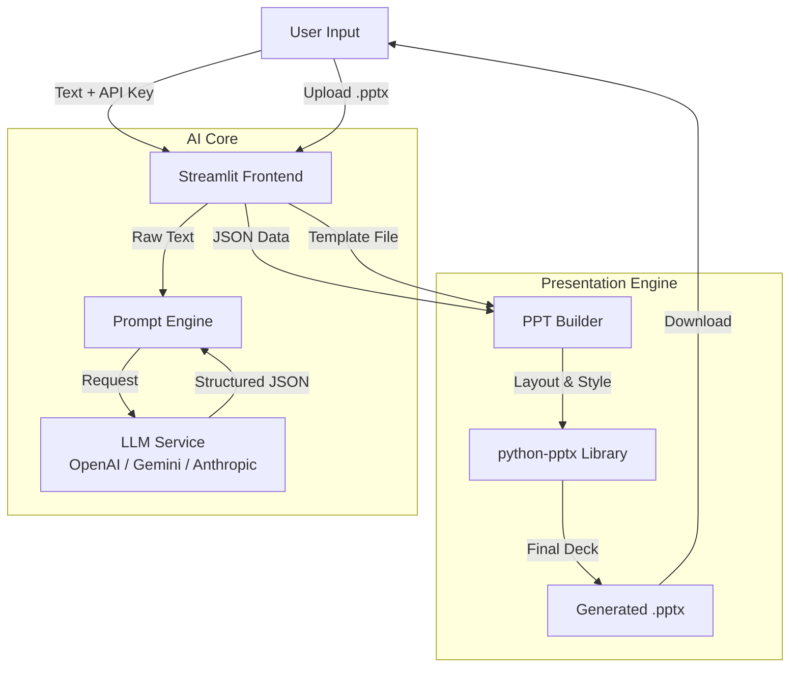

# 📊 Your Text, Your Style – AI Presentation Generator

[](https://smart-ppt-generator.streamlit.app/)


> **🔴 Live Demo:** [Click here to try the App](https://smart-ppt-generator.streamlit.app/) *(Note: Requires deployment)*

A publicly accessible web application that converts bulk text, markdown, or prose into fully formatted PowerPoint presentations. It intelligently analyzes content using Large Language Models (LLMs) and applies the visual style, layouts, and assets from a user-uploaded template.

Unlike generic generators, this tool **respects your brand** by using your own uploaded `.pptx` template to style specific layouts, fonts, and colors.

---

## 🚀 Key Features

*   **📄 Text-to-Deck Conversion**: Instantly creates structured slides (Title, Bullets, Notes) from long-form content using LLMs.
*   **🎨 Template Preservation**: Upload *your* `.pptx` master file. The engine uses your layouts, backgrounds, and fonts—it doesn't just paste text on a white slide.
*   **🧠 Intelligent Parsing**: Uses OpenAI, Anthropic, or Gemini to analyze semantic structure, ensuring logical flow (Intro → Content → Conclusion).
*   **📐 Smart Layout Engine**:
    *   Auto-detects slide boundaries.
    *   Prevents content overflow and title overlaps.
    *   Dynamically resizes text to fit available placeholders.
*   **🔒 Privacy First**: API keys are processed in memory and never stored. Data is discarded immediately after generation.

---

## 🛠️ System Architecture

The system follows a linear pipeline architecture, separating the **Content Logic** (LLM) from the **Presentation Logic** (python-pptx).



---

## 📂 Project Structure

```bash
smart_ppt_generator/
├── app.py                 # Main application entry point (Streamlit)
├── requirements.txt       # Project dependencies
├── README.md              # Documentation
└── utils/
    ├── __init__.py
    ├── llm_engine.py      # LLM interface, retry logic, and JSON parsing
    └── ppt_engine.py      # PowerPoint generation and layout calculation
```

---

## ⚙️ Technical Architecture

### 1. The Parsing Engine (`llm_engine.py`)
*   **Role**: Converts unstructured prose into strict JSON.
*   **Logic**: Uses a robust regex extractor (`extract_json_from_text`) to handle LLM quirks (e.g., markdown fences).
*   **Reliability**: Implements `api_retry_wrapper` to handle transient network errors or rate limits.

### 2. The Presentation Builder (`ppt_engine.py`)
*   **Role**: Maps JSON data to the physical PowerPoint XML structure.
*   **Layout Intelligence**:
    *   Iterates through the uploaded template's slide layouts.
    *   Calculates `safe_top` margins dynamically based on title height to prevent overlaps.
    *   Uses a "Fit-to-Box" algorithm to constrain text content within slide boundaries.

---

## 💿 Installation & Setup

### Prerequisites
*   Python 3.8 or higher
*   An API Key from OpenAI, Google Gemini, or Anthropic.

### Step-by-Step Guide

1.  **Clone the Repository**
    ```bash
    git clone https://github.com/Ram9608/Smart_PPT_Generator.git
    cd Smart_PPT_Generator
    ```

2.  **Create a Virtual Environment**
    ```bash
    # Windows
    python -m venv venv
    venv\Scripts\activate

    # Mac/Linux
    python3 -m venv venv
    source venv/bin/activate
    ```

3.  **Install Dependencies**
    ```bash
    pip install -r requirements.txt
    ```

4.  **Run the Application**
    ```bash
    streamlit run app.py
    ```

---

## 📖 Usage Guide

1.  **Configuration**:
    *   Open the sidebar settings.
    *   Select your AI Provider (e.g., Google Gemini).
    *   Enter your API Key (Securely handled).

2.  **Upload Template**:
    *   Upload a standard `.pptx` file.
    *   *Tip: Ensure your template has a valid 'Title and Content' layout.*

3.  **Input Content**:
    *   Paste your article, report, or rough notes into the text area.
    *   Set the "Tone" (e.g., Professional, Fun, Pitch Deck).

4.  **Generate & Download**:
    *   Click **Generate Preview** to audit the slide structure.
    *   Click **Download PowerPoint** to build the final file.

---

## 🛡️ Privacy & Security

*   **No Data Retention**: This application parses text in-memory. No content is saved to a database.
*   **Ephemeral Keys**: API keys are valid only for the active session and are wiped upon reload or closure.
*   **Local Processing**: The final `.pptx` assembly happens locally on the server (or your machine), ensuring your template assets stay private.

---

## 📄 License

This project is licensed under the MIT License - see the LICENSE file for details.

---

*Built with ❤️ by Ram Bhajan Sahu*
