# 🎨 Your Text, Your Style – AI Presentation Generator

[](https://opensource.org/licenses/MIT)
[](https://smart-ppt-generator.streamlit.app/)
[](https://www.python.org/)

A publicly accessible web application that converts bulk text, markdown, or prose into fully formatted PowerPoint presentations. It intelligently analyzes content using Large Language Models (LLMs) and applies the visual style, layouts, and assets from a user-uploaded template.

**[🔴 CLICK HERE FOR LIVE DEMO](https://smart-ppt-generator.streamlit.app/)**

---

## 🏗️ Visual Architecture

```mermaid
graph TD
    %% Nodes
    User([👤 User])
    UI[🖥️ Streamlit Frontend]
    
    subgraph "Phase 1: Content Analysis (LLM Engine)"
        LLM[🧠 LLM Engine]
        API{AI Provider}
        JSON[📄 Structured JSON]
    end
    
    subgraph "Phase 2: Visual Synthesis (PPT Engine)"
        Parser[🔍 Template Parser]
        ImgLib[🖼️ Image Harvester]
        Builder[🛠️ Slide Builder]
        Logic[📐 Collision & Layout Logic]
    end
    
    Output[(📊 Final .pptx)]

    %% Connections
    User -->|1. Text + Tone + API Key| UI
    User -->|2. Upload Template| UI
    
    UI -->|Raw Text| LLM
    LLM -->|"API Call (Retry Logic)"| API
    API -->|Response| LLM
    LLM -->|Cleaned Data| JSON
    
    UI -->|Template File| Parser
    Parser -->|Extract Assets| ImgLib
    
    JSON -->|Slide Data| Builder
    Parser -->|Master Styles| Builder
    ImgLib -->|Reuse Images| Builder
    
    Builder -->|Check Overlaps| Logic
    Logic -->|Adjusted Layouts| Builder
    
    Builder -->|Generate File| Output
    Output -->|Download| User

    %% Styling
    style UI fill:#6a11cb,stroke:#333,stroke-width:2px,color:white
    style API fill:#ff9a9e,stroke:#333,stroke-width:2px,color:black
    style Output fill:#00b09b,stroke:#333,stroke-width:2px,color:white
```



## 🚀 Key Features

### 🧠 Intelligent Content Parsing
- **Bulk Text to Slides:** Transforms long articles, reports, or notes into structured slide decks (Title, Bullets, Notes).
- **LLM Agnostic:** Supports **OpenAI (GPT-4o)**, **Anthropic (Claude 3.5)**, and **Google Gemini**.
- **User Guidance:** Accepts tone instructions (e.g., "Professional", "Investor Pitch", "Storytelling").
- **Auto-Generated Speaker Notes:** Creates script-like notes for every slide to assist the presenter.

### 🎨 Smart Template Engine (No AI Image Generation)
- **Style Inheritance:** Preserves fonts, colors, and layouts from your uploaded `.pptx` or `.potx` file.
- **Asset Harvesting:** Extracts existing images from the template and intelligently reuses them across new slides.
- **Collision Detection:** Uses a custom algorithm to prevent text from overlapping with titles or header graphics.
- **Smart Sizing:** Auto-fits content and images to prevent overflow or distortion.

### 🛡️ Privacy & Security
- **BYO Key:** Users provide their own API keys.
- **Zero Retention:** API keys are processed in memory and deleted immediately after the session ends. They are never logged or stored.

---

## 🛠️ Technical Architecture & Logic

### 1. Parsing and Mapping Input Text
The application uses a robust **Chain-of-Thought** prompting strategy to break down unstructured text. 
- **Input Analysis:** The text is sent to the selected LLM with a system prompt that enforces a strict JSON schema. This schema divides content into `slides`, `titles`, `bullets`, and `speaker_notes`.
- **Resilience:** A custom regex parser (`extract_json_from_text`) and an `api_retry_wrapper` ensure that even if the LLM adds conversational filler or the API times out, the system recovers and parses the data correctly.
- **Slide Estimation:** The app calculates an optimal slide count based on character density (~500 chars/slide) to ensure good pacing.

### 2. Visual Style & Asset Application
Unlike standard text-to-ppt tools that create generic slides, this engine uses `python-pptx` to manipulate the *internal XML* of the uploaded template:
- **Layout Inference:** The engine scans the template for specific layouts ("Title and Content", "Picture with Caption"). If a perfect match isn't found, it falls back to a custom "Smart Layout" logic.
- **Smart Collision Detection:** To handle custom templates with large headers, the engine calculates the visual boundary of the Title placeholder. It creates a "barrier" (e.g., `Title Bottom + 0.5 inches`). Body text is forcibly pushed below this barrier to guarantee zero overlap.
- **Image Reuse Strategy:** The system extracts binary image data (blobs) from the template. It then distributes these images cyclically across the new slides. A `fit_image_in_box` algorithm calculates aspect ratios to ensure images are centered and scaled without stretching.

---

## ⚙️ Installation & Setup

### Prerequisites
- Python 3.8 or higher
- An API Key from OpenAI, Anthropic, or Google

### Steps

1. **Clone the Repository**
   ```bash
   git clone https://github.com/Ram9608/Smart_PPT_Generator.git
   ```

2. **Create a Virtual Environment**
   ```bash
   python -m venv venv
   # Windows:
   venv\Scripts\activate
   # Mac/Linux:
   source venv/bin/activate
   ```

3. **Install Dependencies**
   ```bash
   pip install -r requirements.txt
   ```

4. **Run the Application**
   ```bash
   streamlit run app.py
   ```

---

## 📂 Project Structure

```text
├── app.py                 # Main Streamlit frontend application
├── utils/
│   ├── llm_engine.py      # LLM API handling, prompt engineering, and JSON parsing
│   └── ppt_engine.py      # PowerPoint generation, layout logic, and image handling
├── requirements.txt       # Project dependencies
├── README.md              # Documentation
└── LICENSE                # MIT License
```

---

## 📝 Usage Guide

1. **Configuration:**
   - Select your AI Provider (e.g., Google Gemini).
   - Paste your API Key (it will be treated securely).
   - Select a Tone (e.g., "Corporate" or "Startup").

2. **Upload Template:**
   - Upload a `.pptx` file. The app will learn its style.

3. **Input Content:**
   - Paste your article, blog post, or notes into the text area.

4. **Generate:**
   - Click **"Generate Preview"** to see the slide plan.
   - Click **"Download PowerPoint"** to get the final file.

---

## 📄 License

This project is licensed under the MIT License - see the LICENSE file for details.
